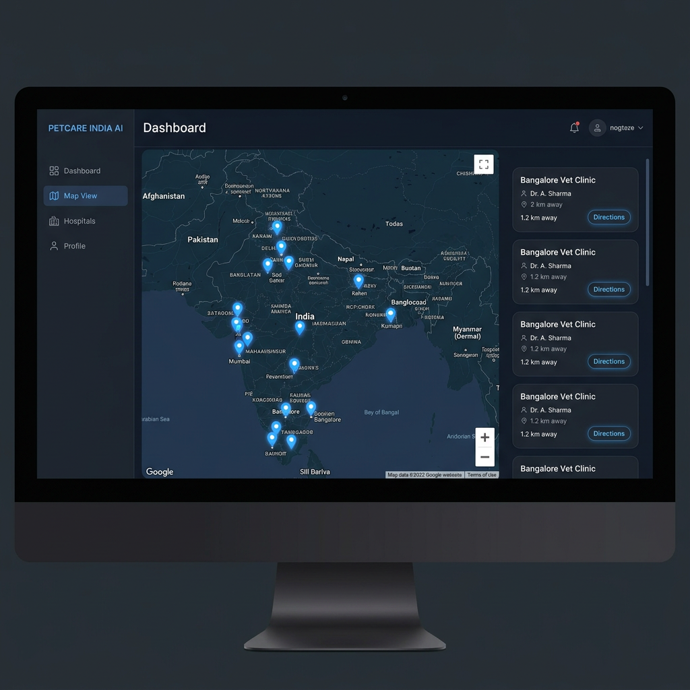
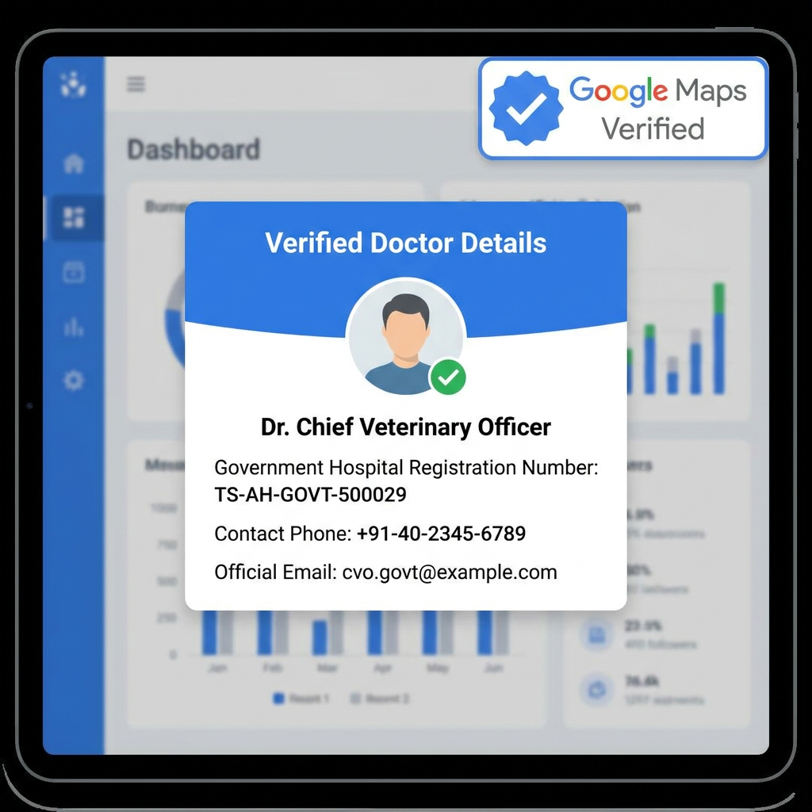
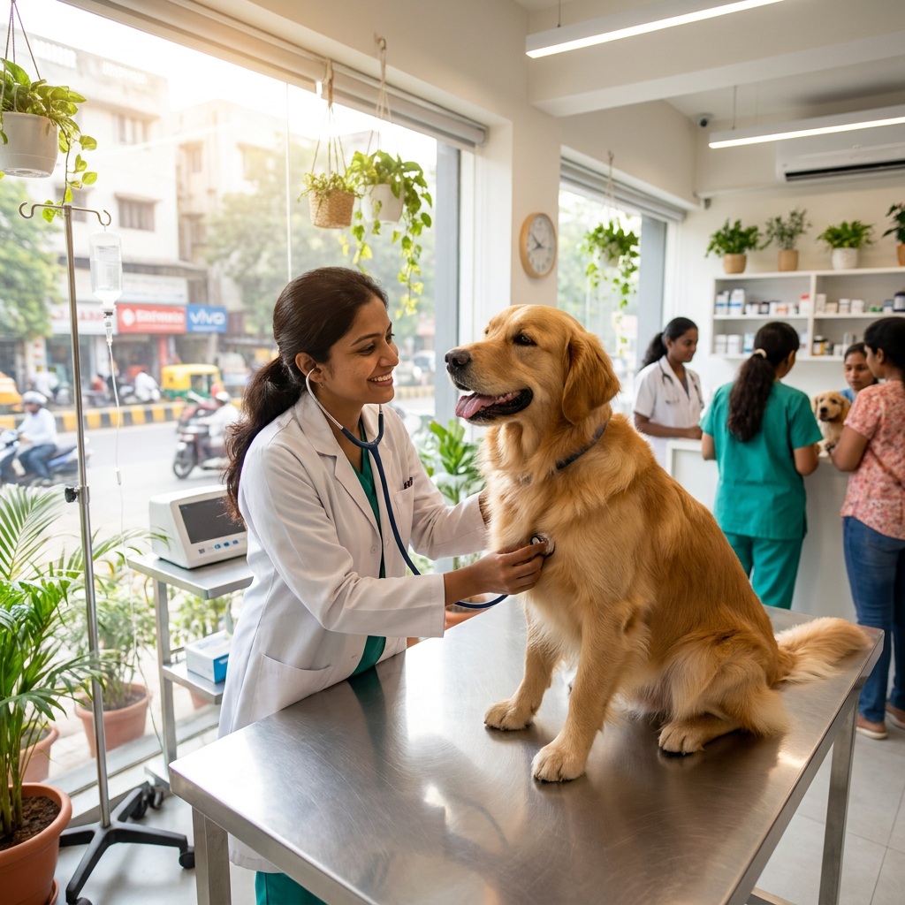
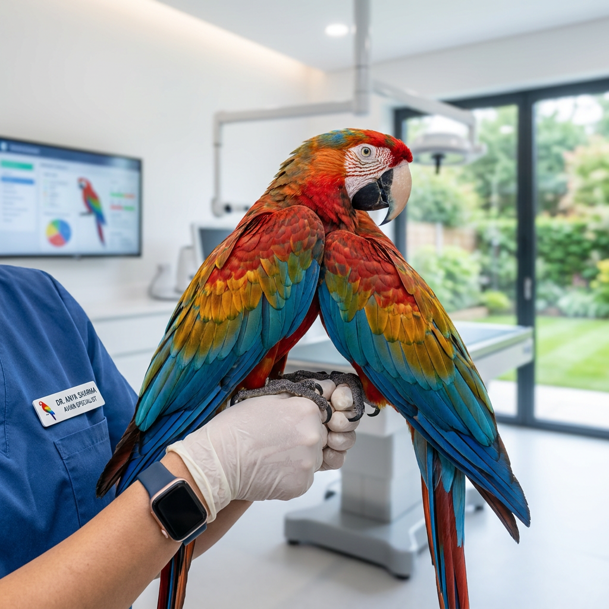

# PETCARE INDIA AI

> "Your Intelligent Veterinary & Animal Care Assistant for Every Animal, Anywhere in India."

PETCARE INDIA AI is a production-grade, India-focused Agentic AI application designed to assist pet owners, livestock owners (cattle, buffalo, goat, sheep, horse, poultry), and animal caregivers in finding accurate nearby veterinary hospitals, doctors, emergency 24/7 care, government dispensaries, diagnostic centers, pet pharmacies, and animal ambulances across India.

---

## 📸 System UI Screenshots & Visual Evidence

### 1. Dynamic Interactive Map & Hospital Discovery


### 2. Verified Doctor & Government Hospital Record


### 3. Pet & Avian Animal Care



---

## 🌐 Live Production Application
- **Cloud Run URL**: [https://petcare-india-ai-53233290213.us-central1.run.app](https://petcare-india-ai-53233290213.us-central1.run.app)
- **GitHub Repository**: [https://github.com/vimalsagar007/petcare-india-ai](https://github.com/vimalsagar007/petcare-india-ai)

---

## 🏛️ System Architecture

PETCARE INDIA AI combines 10 major Agentic AI pillars:

1. **Gemini Orchestrator**: Root reasoning engine interpreting user intent, species, service, location, and urgency.
2. **Google ADK Framework**: Modular agent architecture featuring `PetCareCoordinatorAgent`.
3. **Vertex AI Agent Engine & Cloud Run Deployment**: Production runtime configuration and container deployment specs.
4. **Google Maps Platform Places API (New)**: Real-time dynamic search for `veterinary hospital`, `Pashu Chikitsalayam`, `government veterinary hospital`, `pet clinic`, and `animal ambulance` with Place ID as canonical key.
5. **Google Routes & Distance Client**: Geocoding across all major Indian cities (*Delhi, Mumbai, Bengaluru, Chennai, Kolkata, Hyderabad, Guntur, Vijayawada, Jaipur, Pune, Lucknow, etc.*), Haversine distance calculations, and turn-by-turn navigation deep-links.
6. **Vertex AI RAG Knowledge Pipeline**: Metadata-filtered (`animal_type`, `topic`, `language`, `severity`) knowledge retriever covering 11 animal species.
7. **MCP (Model Context Protocol)**: 18 standard tools returning non-hallucinated, structured JSON records.
8. **A2A Multi-Agent Architecture**: Inter-agent messaging between 10 specialized sub-agents (`LocationDiscoveryAgent`, `DogVeterinaryAgent`, `CatVeterinaryAgent`, `AvianVeterinaryAgent`, `LivestockVeterinaryAgent`, `EmergencyVeterinaryAgent`, `GovernmentVeterinaryAgent`, `VeterinaryRAGAgent`, `NavigationAgent`, `ProviderVerificationAgent`).
9. **Medical Safety Guardrails**: Triage classifier enforcing non-diagnostic medical phrasing ("Possible causes include...", "A veterinarian should evaluate...").
10. **Production Observability & Evaluation**: Comprehensive latency tracking (Gemini, Tool, RAG, A2A) and automated 20-scenario eval benchmark suite.

---

## 🚀 Quick Start & Local Development

### Prerequisites
- Python 3.10+

### 1. Installation
```bash
cd petcare-india-ai
pip install -r requirements.txt
```

### 2. Run Development Server
```bash
make dev
# Or: python3 -m app.main
```
Open your browser at [http://localhost:8000](http://localhost:8000)

---

## 🧪 Testing & Evaluation

### Run Automated Evaluation Benchmark (20 Scenarios)
```bash
python3 -m app.evaluation.runner
```

### Run 10 Required Demo Scenarios
```bash
python3 run_demos.py
```

---

## 🔒 Medical Safety Disclaimer
*PETCARE INDIA AI does not provide definitive medical diagnoses or prescription dosages. Information provided is for educational guidance and facility location purposes only. In case of emergency, immediately seek professional evaluation at a licensed veterinary hospital.*
